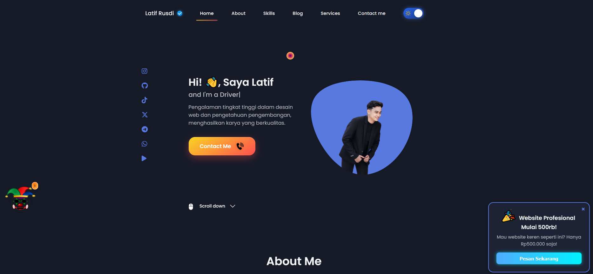

# 🚀 Latif Rusdi — Portfolio Website 2025 🔥
Modern, interactive, and AI-powered personal website with game features, music player, and premium UI.

-------

## 🎯 Deskripsi

Selamat datang di portofolio pribadi **Latif Rusdi** — website modern 2025 dengan desain interaktif, **AI Assistant lucu**, fitur **mini game**, **music player**, dan **dark mode otomatis**. Dibangun sepenuhnya dengan HTML, CSS, dan JavaScript tanpa framework!

-------

## 🌟 Fitur Unggulan

| 🔹 Fitur                  | Deskripsi                                                                 |
|--------------------------|---------------------------------------------------------------------------|
| 🎧 Music Player           | Pemutar musik latar dengan kontrol dinamis dan dukungan responsif         |
| 🤖 Badut AI Assistant     | Chatbot lucu dan interaktif dengan suara, emoji, dan animasi ekspresif    |
| 🎮 Mini Games             | Game logika dan tantangan otak seperti Brain Test                         |
| 🌙 Dark/Light Mode        | Tema otomatis yang menyesuaikan dengan mode sistem pengguna               |
| 🎯 Hero Section Dinamis   | Efek pengetikan otomatis dan animasi scroll yang halus                    |
| 🔐 Login/Register Panel   | Panel geser modern untuk autentikasi dengan transisi elegan               |
| 🌀 Preloader Premium       | Animasi pembuka profesional saat website dimuat pertama kali              |
| 📢 Popup Iklan            | Muncul otomatis dengan desain menarik dan tombol tutup                    |
| 🧱 Struktur Modular        | Struktur kode HTML, CSS, dan JS tertata rapi dan mudah dikembangkan       |
2/2

---

## 🧰 Teknologi & Library

- `HTML5`, `CSS3`, `JavaScript`
- `Typed.js`, `Swiper.js`, `AOS.js`
- `LocalStorage`, `GitHub Pages`

-------

## 🔎 Struktur Direktori

\`\`\`
portfolio-latif/
├── assets/
│   ├── css/          → style.css & media-query
│   ├── icon/         → ikon PNG/emoji interaktif
│   ├── img/          → gambar dan preview
│   ├── js/           → main.js, badut.js, dll.
│   └── pdf/          → dokumen tambahan
├── index.html        → halaman utama
├── brain.html        → halaman mini game
├── pembayaran.html   → halaman sistem pembayaran
├── preview.png       → gambar tampilan
├── LICENSE           → lisensi MIT
└── README.md         → dokumentasi ini
\`\`\`

-------

## 🎥 Tampilan Website

-------

## 🧪 Cara Menjalankan (Offline)

\`\`\`bash
git clone https://github.com/Larusdi/portfolio-latif.git
cd portfolio-latif
# Lalu buka index.html di browser (double klik atau drag)
\`\`\`

📌 Tidak perlu XAMPP / server lokal. 100% static!

-------

## 🌍 Demo Langsung

👉 [Klik untuk melihat versi live!](https://larusdi.github.io/portfolio-latif/)

-------

## 📬 Kontak & Sosial Media

- ✉️ Email: latifrusdi15@gmail.com  
- 📱 WhatsApp: [Chat Langsung](https://wa.me/6282389160273)  
- 🐙 GitHub: [@Larusdi](https://github.com/Larusdi)  
- 📸 Instagram: [@29_larusdi](https://www.instagram.com/29_larusdi)

-------

## 📄 Lisensi

Lisensi: [MIT License](LICENSE)  
Silakan gunakan, modifikasi, dan kembangkan proyek ini dengan tetap memberikan atribusi kepada pembuat asli 🙏

-------

## ⭐ Dukungan

Jika kamu suka dengan project ini, jangan lupa kasih bintang ⭐ di GitHub!  
Butuh bantuan atau ingin kolaborasi? Kirim pesan saja! Terima kasih ❤️

-------

[🔼 Kembali ke Atas](#top)
